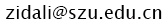

### **Openings:**

**_Postdocs:_**

We have a few openings of postdocs for both domestic and international applicants with expertises in, but not limited to, microfluidics, cell biology, or cancer. Qualified candidates shall contact Dr. Li via email with your CV and a cover letter. Details about postdoc positions are [here](postdoc.html).

**_Graduate students_**

We welcome motivated graduate students, including PhD and Master's, to work with us. Please contact Dr. Li for inquiry.

**_Undergrad Research Assistants:_**

We welcome motivated undergrads to work with us. Please contact Dr. Li for inquiry.

    <h3>Address:</h3>
    
A2-425, Xili Campus 
        1066 Xueyuan Ave., Nanshan Dist. 
        Shenzhen, Guangdong 518055, China
    

    <h3>Email: </h3>
    

    <iframe src="https://www.google.com/maps/embed?pb=!1m18!1m12!1m3!1d3683.629004841502!2d113.99162031537146!3d22.592974937915297!2m3!1f0!2f0!3f0!3m2!1i1024!2i768!4f13.1!3m3!1m2!1s0x3403f2fb482641b3%3A0x1036248b9d42162f!2sShenzhen+University+Xili+Campus!5e0!3m2!1sen!2sjp!4v1531045804848" width="450" height="350" frameborder="0" style="border:0" allowfullscreen></iframe>

