

    <h3>Group photos</h3>

    

	  
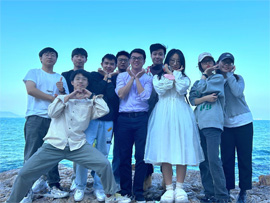
		  

			
12/2022: Lab retreat by the sea.

		  

	  
  
    
 
    

	  
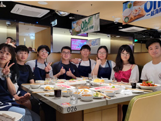
		  

			
05/2022: Celebration of Linzhe's defense.

		  

	  
  
    
 
    

	  
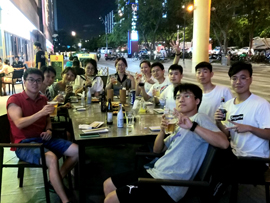
		  

			
07/2021: Farewell party for Lanzhu and Tao.

		  

	  
  
    
 
    

	  
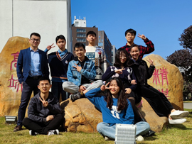
		  

			
02/2021: Group photo on Lihu Campus.

		  

	  
  
    
 
    

	  
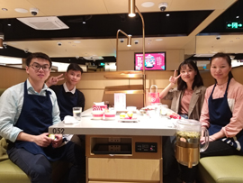
		  

			
01/2020: Hotpot gathering (right before COVID19).

		  

	  
  
    
 
    

	  
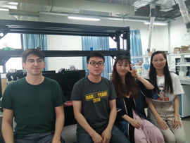
		  

			
06/2019: Just another group photo.

		  

	  
  
    
 
    

	  
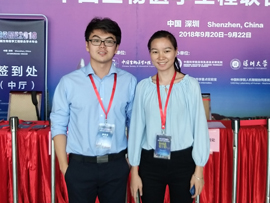
		  

			
09/2018: CBME conference.

		  

	  
  
    

	

    <h3>Defense celebration</h3>

    

	  
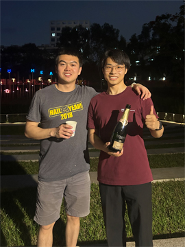
		  

			
Celebration of Run's defense. (Spring 2023)

		  

	  
  
    
 
    

	  
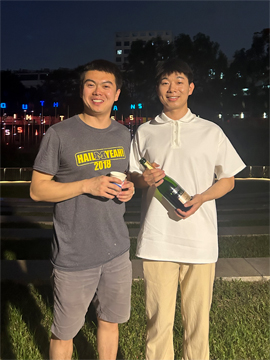
		  

			
Celebration of Kai's defense. (Spring 2023)

		  

	  
  
    
 
    

	  
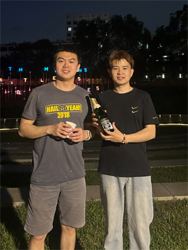
		  

			
Celebration of Donghao's defense. (Spring 2023)

		  

	  
  
    
 	
    

	  
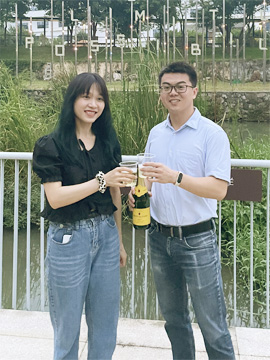
		  

			
Celebration of Linzhe's defense. (Spring 2022)

		  

	  
  
    
 
    

	  
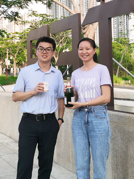
		  

			
Celebration of Lanzhu's defense. (Spring 2021)

		  

	  
  
    

    <h3>Other photos</h3>

	

    

	  
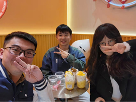
		  

			
Eating coconut ice cream! (Spring 2022)

		  

	  
  
    
 
    

	  
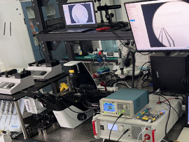
		  

			
Some messy but cool setup.(Spring 2021)

		  

	  
  
    
 
    

	  
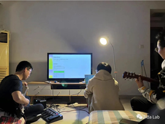
		  

			
Lab jam session. (Spring 2022)

		  

	  
  
    
 
    

	  
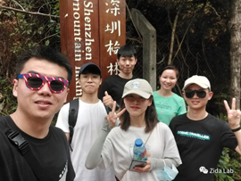
		  

			
Lab hiking. (Spring 2021)

		  

	  
  
    
 
    

	  
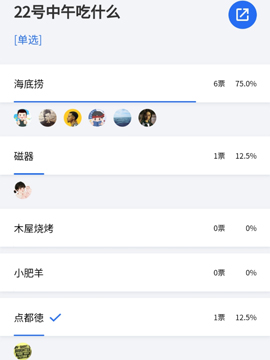
		  

			
Where shall we eat? (Spring 2022)

		  

	  
  
    
 
    

	  
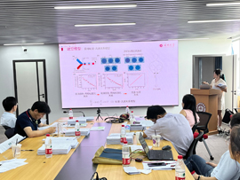
		  

			
Linzhe in her thesis defense. (Spring 2022)

		  

	  
  
    
 
    

	  
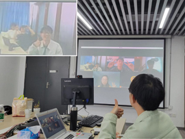
		  

			
Hybrid meeting in this special time. (Spring 2022)

		  

	  
  
    
 
    

	  
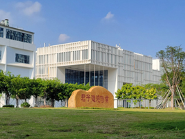
		  

			
Campus is pretty in spring! (Spring 2022)

		  

	  
  
    
 
    

	  
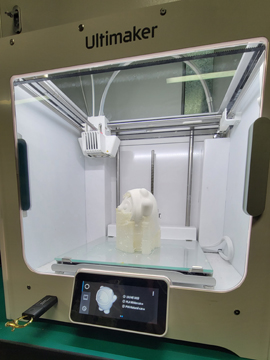
		  

			
3D-printing Bing-Dun-Dun! (Spring 2022)

		  

	  
  
    
 
    

	  
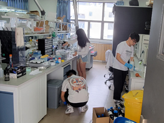
		  

			
Lab cleanup. (Spring 2022)

		  

	  
  
    
 
    

	  
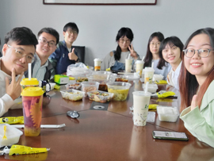
		  

			
Lunch meeting after a ridiculously long winter break! (Spring 2022)

		  

	  
  
    
 
    

	  
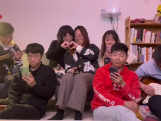
		  

			
Just another lab jam session. (Spring 2022)

		  

	  
  
    
 
    

	  
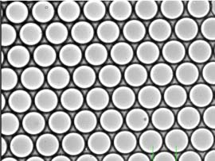
		  

			
Droplets.

		  

	  
  
    
 
    

	  
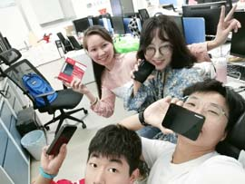
		  

			
Data found good homes.

		  

	  
  
    
 
    

	  
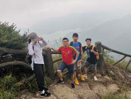
		  

			
Hiking at Wutong Mountain.

		  

	  
  
    
 
    

	  

		  

			
Dr. Li visiting our collaborators at BGI.

		  

	  
  
    
 
    

	  

		  

			
UM-Shenzhen alumni gathering.

		  

	  
  
    
 
    

	  
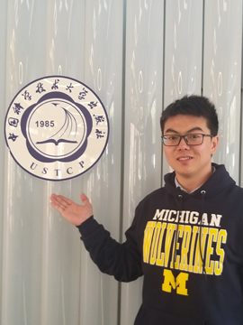
		  

			
Visiting USTC with a Wolverine hoodie.

		  

	  
  
    
 
    

	  

		  

			
Group gathering at Haidilao Hotpot before Spring Festival.

		  

	  
  
    
 
    

	  

		  

			
Dr. Li presenting work on single cell at FLOCA, Dalian.

		  

	  
  
    
 
    

	  

		  

			
Group photo with Feng Lin (PKU) and Weiqiang Chen (NYU) at a mechanobiology conference. 

		  

	  
  
    
 
    

	  

		  

			
Nick in his qualifying exam.

		  

	  
  
    
 
    

	  

		  

			
Band perferming at annual dinner of the department.

		  

	  
  
    
 
    

	  

		  

			
Kart riding. (Summer 2019)

		  

	  
  
    
 
    

	  

		  

			
Graduation photo at North Campus of UM.

		  

	  
  
    
 
    
	  
        

		  

			
Using surface tension as a friend.

		  

	    
  
	

	  
