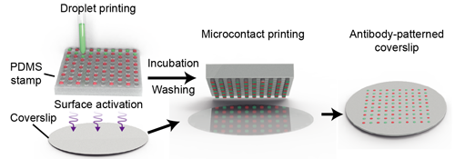
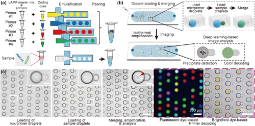
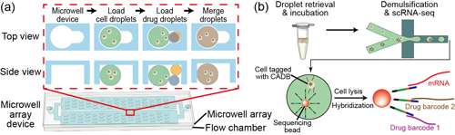
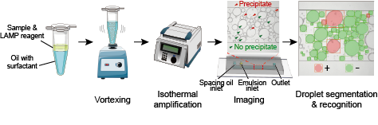
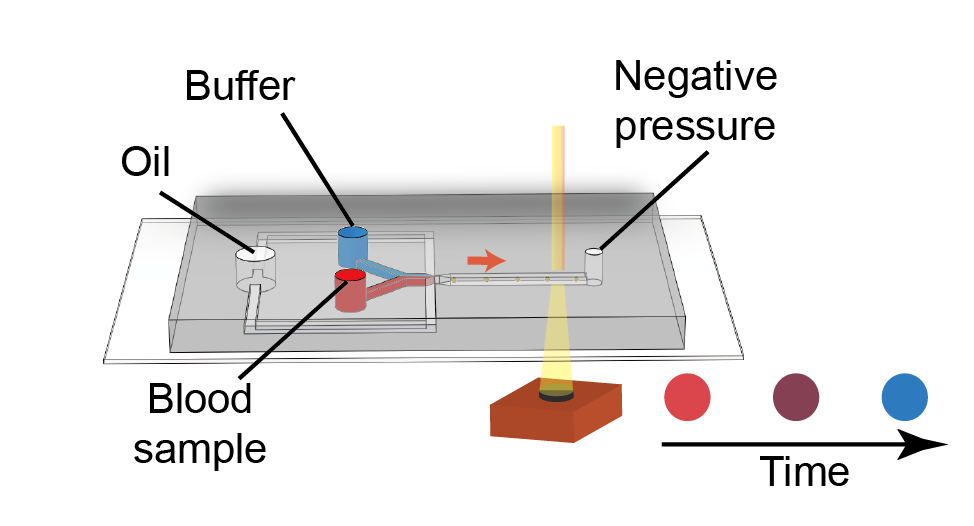
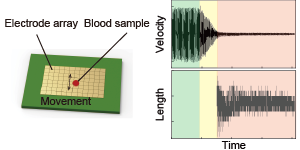
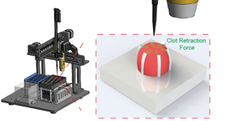

    <h1 style="text-align:center;">About Us</h1>
    

    
Welcome to our lab at the School of Biomedical Engineering at Shenzhen University.

    
Our lab is dedicated to developing miniaturized in-vitro diagnostic tools using emerging micro/nano-technologies. Specifically, we leverage our expertise in microfluidics, MEMS, nanomaterials, and soft matter, and develop innovative blood coagulation tests and interruptive single-cell sequencing technology.

    
Located in the Greater Bay Area of China with a fast-growing biotechnology community, our lab is made up of a group of enthusiastic young scientists with the aim of developing fast, accurate, and affordable clinical tests. To learn more, please visit <a href="people.html">Members</a>.

        
        
<b>Meet the lab</b> 
        Back: Meichi Jin, Jingyi Ding, Run Xie, Kai Wu, Zhantao Zhao, Zida Li 
        Front: Donghao Li, Wanjun Yao, Qi Fang, Heng Zhai

    

    <h2>Selected Publications</h2>
    

        
		
<b>High resolution, multiplex antibody patterning using micropillar-focused droplet printing and microcontact printing</b> (<a href="https://doi.org/10.1002/adbi.202300111">DOI</a>) 
		Meichi Jin, Zida Li,*<b><i>Advanced Biology</i></b>, 2023 

    

        
		
<b>CoID-LAMP: Color-encoded, intelligent digital LAMP for multiplexed nucleic acid quantification</b> (<a href="https://doi.org/10.1021/acs.analchem.2c05665">DOI</a>) 
		Kai Wu,# Qi Fang,# Zida Li,* et al., <b><i>Analytical Chemistry</i></b>, 2023 

    

        
		
<b>Combinatorial perturbation sequencing on single cells using microwell-based droplet random pairing</b> (<a href="https://doi.org/10.1016/j.bios.2022.114913">DOI</a>) 
		Run Xie,# Yang Liu,# Ya Liu,* Zida Li,* et al., <b><i>Biosensors and Bioelectronics</i></b>, 2022 

	

		
		
<b>deep-dLAMP: deep learning-enabled polydisperse emulsion-based digital loop-mediated isothermal amplification</b> (<a href="https://doi.org/10.1002/advs.202105450">DOI</a>) 
		Linzhe Chen,# Jingyi Ding,# Chi Chen,* Zida Li,* et al., <b><i>Advanced Science</i></b>, 2022 

    

		
		
<b>Point-of-care blood coagulation assay based on dynamic monitoring of blood viscosity using droplet microfluidics</b> (<a href="https://doi.org/10.1021/acssensors.1c02360">DOI</a>) 
		Linzhe Chen, Zida Li,* et al., <b><i>ACS Sensors</i></b> 2022 

    

		
		
<b>Point-of-care blood coagulation assay enabled by printed circuit board-based digital microfluidics</b> (<a href="https://doi.org/10.1039/D1LC00981H">DOI</a>) 
		Donghao Li,# Xinyu Liu,# Yujuan Chai,# Zida Li,* et al., <b><i>Lab on a Chip</i></b>, 2022 

    

		
		
<b>Micro-engineered flexural post rings for effective blood sample fencing and high throughput measurement of clot retraction force</b> (<a href="https://doi.org/10.1021/acssensors.0c01596">DOI</a>) 
		Lanzhu Huang,# Xinyu Liu,# Zida Li,* et al., <b><i>ACS Sensors</i></b>, 2020 

	

    <h2>Recent News</h2>
	

    

        
<b>Apr. 2022</b>: Our paper on microfluidic viscometer for blood coagulation assay has been accepted by <a href="https://doi.org/10.1021/acssensors.1c02360">ACS Sensors</a>!

    

        
<b>Jan. 2022</b>: Our paper on polydisperse digital nucleic acid test has been accepted by <a href="https://doi.org/10.1002/advs.202105450">Advanced Science</a>!

    

	    
<b>Jan. 2022</b>: Our paper on PCB-based digital microfluidics coagulation assay has been accepted by <a href="https://doi.org/10.1039/D1LC00981H">Lab on a Chip</a>!

    

	    
<b>Sep. 2021</b>: Meichi Jin, Zhantao Zhao, and Jingyi Ding joined our group as Master's students. Welcome on board!

    

	    
<b>Dec. 2020</b>: Our review paper on COVID-19 diagnostics using emerging biosensors has been accepted by <a href="https://doi.org/10.1016/j.talanta.2020.121986">Talanta</a>!

    

	    
<b>Nov. 2020</b>: Our research article on high throughput clot retraction assay has been accepted by <a href="https://doi.org/10.1021/acssensors.0c01596">ACS Sensors</a>!

    

	    
<b>Sep. 2020</b>: Run Xie, Kai Wu, and Donghao Li joined our group as Master's students. Meichi Jin joined as a final year project student. Welcome on board!

    

	    
<b>Nov. 2019</b>: Our review paper collaborated with Prof. Tiantian Kong on stretchable supercapacitors has been accepted by <a href="https://doi.org/10.1002/aenm.201902769">Advanced Energy Materials</a>!

    

	    
<b>Oct. 2019</b>: Our group has been awarded Mianshang Grant by the Guangdong Science and Technology Agency!

    

        
<b>June 2019</b>: Our group has been awarded the Med Research Grant by the Hygiene and Health Committee of Guangdong Province!

    

	    
<b>June 2019</b>: Nick and Linzhe joined our group as grad students! Welcome!

    

	    
<b>Apr. 2019</b>: Two of our collaborative works have been published on <a href="https://doi.org/10.1021/acssensors.9b00171">ACS Sensors</a> and <a href="https://doi.org/10.1063/1.5086716">Biomicrofluidics</a>, respectively!

    

	    
<b>Sep. 2018</b>: Lanzhu joined our group as a grad student! Welcome!

    

	    
<b>July 2018</b>: Lab established!

    

	<h2>Funding Support</h2>
	

    
The research of our group is proudly supported by
	    <ul>
		    <li>Science and Technology Agency of Guangdong Province</li>
		    <li>Guangdong Committee of Hygiene and Health</li>
		    <li>Department of Human Resource and Social Security, Shenzhen</li>
		    <li>Shenzhen University</li>
        </ul>
	

	<h2>Links</h2>
	

    	
    

	    
    

	    
    

	    
    

