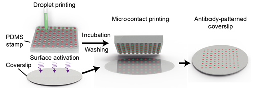
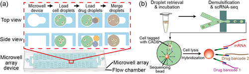
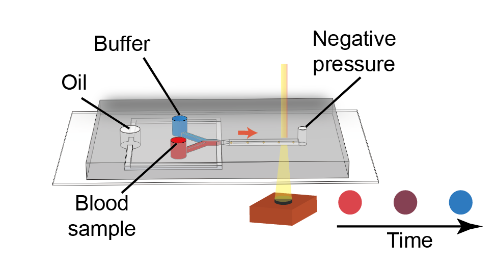
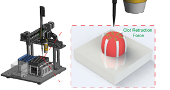

    <h1 style="text-align:center;">关于我们</h1>
    

    
欢迎来到我们在深圳大学生物医学工程学院的课题组。

    
我们课题组致力于利用微纳米技术开发小型化体外诊断工具。具体而言，我们发挥在微流控、微机电系统、纳米材料、软物质领域的专长，开发新型凝血功能检验技术和有突破性的单细胞测序技术。

    
我们课题组是由一群热爱科研的青年科学家组成。依托粤港澳大湾区迅速发展的生物科技社区，我们有志于开发快速、准确、廉价的临床检验技术。请访问我们的<a href="people_CN.html">成员页面</a>以了解更多。

    
    
<b>课题组合影</b> 
        后排：金美池、丁婧怡、谢润、武凯、赵展陶、李自达 
        前排：李东豪、姚婉君、方琪、翟恒

    

    <h2>代表著作</h2>
    

    
    
<b>High resolution, multiplex antibody patterning using micropillar-focused droplet printing and microcontact printing</b> (<a href="https://doi.org/10.1002/adbi.202300111">DOI</a>) 
        Meichi Jin, Zida Li,*<b><i>Advanced Biology</i></b>, 2023 

    

    
    
<b>CoID-LAMP: Color-encoded, intelligent digital LAMP for multiplexed nucleic acid quantification</b> (<a href="https://doi.org/10.1021/acs.analchem.2c05665">DOI</a>) 
        Kai Wu,# Qi Fang,# Zida Li,* et al., <b><i>Analytical Chemistry</i></b>, 2023 

    

    
    
<b>Combinatorial perturbation sequencing on single cells using microwell-based droplet random pairing</b> (<a href="https://doi.org/10.1016/j.bios.2022.114913">DOI</a>) 
        Run Xie,# Yang Liu,# Ya Liu,* Zida Li,* et al., <b><i>Biosensors and Bioelectronics</i></b>, 2022 

    

    
    
<b>deep-dLAMP: deep learning-enabled polydisperse emulsion-based digital loop-mediated isothermal amplification</b> (<a href="https://doi.org/10.1002/advs.202105450">DOI</a>) 
        Linzhe Chen,# Jingyi Ding,# Chi Chen,* Zida Li,* et al., <b><i>Advanced Science</i></b>, 2022 

    

    
    
<b>Point-of-care blood coagulation assay based on dynamic monitoring of blood viscosity using droplet microfluidics</b> (<a href="https://doi.org/10.1021/acssensors.1c02360">DOI</a>) 
        Linzhe Chen, Zida Li,* et al., <b><i>ACS Sensors</i></b> 2022 

    

    
    
<b>Point-of-care blood coagulation assay enabled by printed circuit board-based digital microfluidics</b> (<a href="https://doi.org/10.1039/D1LC00981H">DOI</a>) 
        Donghao Li,# Xinyu Liu,# Yujuan Chai,# Zida Li,* et al., <b><i>Lab on a Chip</i></b>, 2022 

    

    
    
<b>Micro-engineered flexural post rings for effective blood sample fencing and high throughput measurement of clot retraction force</b> (<a href="https://doi.org/10.1021/acssensors.0c01596">DOI</a>) 
        Lanzhu Huang,# Xinyu Liu,# Zida Li,* et al., <b><i>ACS Sensors</i></b>, 2020 

    

<!-- 		

            
            
<b>Single-cell sequencing to unveil the mystery of embryonic development</b> (<a href="https://doi.org/10.1002/adbi.202101151">DOI</a>) 
            Zida Li,#,* Feng Lin,# Yue Shao,* et al., <b><i>Advanced Biology</i></b>, 2022. 

        

        

            
            
<b>Emerging biosensing technologies for improved diagnostics of COVID-19 and future pandemics</b> (<a href="https://doi.org/10.1016/j.talanta.2020.121986">DOI</a>) 
            Linzhe Chen, Longqi Liu,* Zida Li,* et al., <b><i>Talanta</i></b>, 2021. 

        

     -->

<!-- 		

            
            
Stretchable supercapacitors as emergent energy storage units for health monitoring bioelectronics  (<a href="docs/2019_AEM_Chen.pdf">PDF</a>) 
            Xue Chen, Zida Li*, Tiantian Kong*, et al., <i><b>Advanced Energy Materials</b></i>, 2019. 

        

        

            
            
Dean flow assisted single cell and bead encapsulation for high performance single cell expression profiling (<a href="docs/2019_ACSSensors_Li.pdf">PDF</a>) 
            Luoquan Li#, Ping Wu#, Zida Li*, Liqun He*, et al., <i><b>ACS Sensors</b></i>, 2019. 

        

        

            
            
Multiple splitting of droplets using multi-furcating microfluidic channels (<a href="docs/2019_BMF_Li.pdf">PDF</a>) 
            Zida Li*, Ping Wu*, et al., <i><b>Biomicrofluidics</b></i>, 2019. 

        
 -->

<!-- 		

            
            
A miniaturized hemoretractometer (mHRM) for blood clot retraction testing (<a href="docs/2016_Small_Li.pdf">PDF</a>) 
            Zida Li, Jianping Fu*, et al., <i><b>Small</b></i>, 2016. 

        

        

            
            
Syringe-pump-induced fluctuation in all-aqueous microfluidic system implications for flow rate accuracy (<a href="docs/2014_LabChip_Li.pdf">PDF</a>) 
            Zida Li, Ho Cheung Shum*, et al., <i><b>Lab on a Chip</b></i>, 2014.

        
 -->

    <h2>新闻</h2>
    

    
<b>Apr. 2022</b>: 我们研究的用于凝血检测的微流控粘度计的工作被 <a href="https://doi.org/10.1021/acssensors.1c02360">ACS Sensors</a>接收！

    

    
<b>Jan. 2022</b>: 我们研究非均一体积数字核酸检测的工作被 <a href="https://doi.org/10.1002/advs.202105450">Advanced Science</a>接收！

    

    
<b>Jan. 2022</b>: 我们研究的用PCB数字微流控实现凝血检验的工作被 <a href="https://doi.org/10.1039/D1LC00981H">Lab on a Chip</a>接收！

    

    
<b>Sep. 2021</b>: 金美池、赵展陶、丁婧怡作为硕士研究生。欢迎！

    

    
<b>2020/12</b>: 金美池同学的本科毕业设计获得深大“百篇优秀毕业论文”！

    

    
<b>2021/4</b>: 陈琳喆同学获得深大“研究生创新发展基金”支持！

    

    
<b>2020/12</b>: 我们总结用于*某敏感词*的诊断的生物传感技术的综述文章被 <a href="./file/2020_Talanta_Chen.pdf">Talanta</a> 接收！

    

    
<b>2020/11</b>: 我们研究高通量凝块收缩检验方法的论文被 <a href="./file/2020_ACSSensors_Huang.pdf">ACS Sensors</a> 接收！

    

    
<b>2020/9</b>: 谢润、武凯、李东豪作为硕士研究生，金美池以本科毕设学生加入我们课题组。欢迎！

    

    
<b>2019/11</b>: 我们与孔湉湉副教授课题组合作的可拉伸超级电容器综述论文被 <a href="./file/2019_AEM_Chen.pdf">Advanced Energy Materials</a> 接收！

    

    
<b>2019/10</b>: 我们课题组被授予广东省自然科学基金面上基金！

    

    
<b>2019/6</b>: 我们课题组被授予广东省卫健委医学科研基金！

    

    
<b>2019/6</b>: Nick 和琳喆加入我们课题组！

    

    
<b>2019/4</b>: 我们的两个合作合体分别发表在 <a href="./file/2019_ACSSensors_Li.pdf">ACS Sensors</a> 和 <a href="./file/2019_BMF_Li.pdf">Biomicrofluidics</a> 上！

    

    
<b>2018/9</b>: 硕士研究生黄兰蛛加入我们课题组！

    

    
<b>2018/6</b>: 课题组成立！

    

    <h2>经费支持</h2>
    

    
我们课题组的研究很荣幸地获得如下机构的支持
        <ul>
            <li>广东省基础与应用基础研究基金委员会</li>
            <li>广东省卫生健康委员会</li>
            <li>深圳市人力资源与社会保障局</li>
            <li>深圳大学</li>
        </ul>
    

    <h2>相关链接</h2>
    

    
    

    
    

    
    

    
    

