

    
<h2>Principal Investigator</h2>

        

            
		

    

        
<strong>Zida Li</strong>, Ph.D. (<a href = "https://scholar.google.com/citations?user=9s8iCB0AAAAJ&amp;hl=en" target="_blank">Google Scholar</a> | <a href=".\docs\CV_Short.pdf" target="_blank">Short CV (Chinese)</a> | <a href=".\docs\CV_Full.pdf" target="_blank">Full CV</a>)

        
Assistant Professor Biomedical Engineeering Shenzhen University 

        
<b>Address</b>:      Rm 425, Bldg A2, Xili Campus, 1066 Xueyuan St., Shenzhen, China 
        <b>Contact</b>:      

    

    

        <h3>Academic Experience</h3>
        

            University of Michigan, Ann Arbor 
            Ph.D., Department of Mechanical Engineering (2013-2018) 
            Advisor: Dr. Jianping Fu
        

        

            University of Hong Kong 
			Research Assistant, Department of Mechanical Engineeering (2012-2013) 
			Advisor: Dr. Anderson Ho Cheung Shum
        

        
 
            Tsinghua University 
			Exchange Student, Department of Aerospace Engineering (2010-2011)
        

		

            University of Science and Technology of China 
			B.E., Department of Thermal Science and Energy Engineering (2008-2012) 
			Advisors: Dr. Liqun He, Dr. Haifeng Zhang
        

        <h3>Selected Awards</h3>
        

            Baxter Young Investigator Award First-Tier, Baxter Healthcare Inc. (2016) 
			Departmental Fellowship, Mechanical Engineering, University of Michigan (2013-2014) 
			Provincial Honored Graduate, Department of Education, Anhui Province, China (2012) 
			National Scholarship, Ministry of Education, China (2011)
        

	

	

    
<h2>Graduate Students</h2>

	

        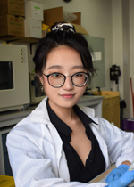
	

	

        

            <strong>Meichi Jin</strong>
             Master's student
        

        

            Address: Bldg A2, Xili Campus
             Email: 2017222079 AT email.szu.edu.cn
        

        

            <strong><u>Academic Training</u></strong> 
			B.S., Biomedical Engineering, Shenzhen University (2017-2021)
        

	

    

        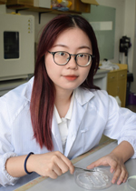
    

    

        

            <strong>Jingyi Ding</strong>
             Master's student
        

        

            Address: Bldg A2, Xili Campus
			 Email: dingjy99 AT 163.com
        

		

            <strong><u>Academic Training</u></strong> 
			B.S., Biomedical Engineering, Shenzhen University (2017-2021)
			 University of California, Berkeley, Exchange program (Jan. 2020-June 2020)
        

	

    

        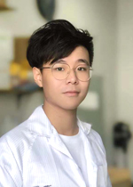
    

    

        

            <strong>Zhantao Zhao</strong>
			 Master's student
        

        

            Address: Bldg A2, Xili Campus
			 Email: 840801648 AT qq.com
        

		

            <strong><u>Academic Training</u></strong> 
			B.S., Biomedical Engineering, Guangdong Medical University (2017-2021)
        

	

    

        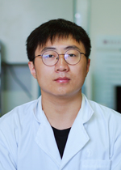
	

    

        

            <strong>Qi Fang</strong>
			 Master's student
        

	    

            Address: Bldg A2, Xili Campus
			 Email: 779574160 AT qq.com
        

	    

            <strong><u>Academic Training</u></strong> 
			B.S., Biomedical Engineering, Anhui Medical University (2018-2022))
        

    

    

        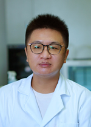
    

    

        

            <strong>Heng Zhai</strong>
			 Master's student
        

        

            Address: Bldg A2, Xili Campus
			 Email: zhaiheng1998 AT outlook.com
        

	    

            <strong><u>Academic Training</u></strong> 
			B.S., Biomedical Engineering, Guangdong Medical University (2017-2021)
        

    

    

        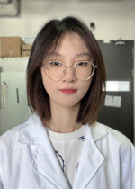
    

    

        

            <strong>Wanjun Yao</strong>
			 Master's student
        

	    

            Address: Bldg A2, Xili Campus
			 Email: yaowanjun2000 AT 163.com
        

	    

            <strong><u>Academic Training</u></strong> 
			B.S., Electrical and Information Engineering, Zhejiang Sci-Tech University (2018-2022)
        

	

    

        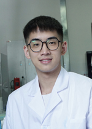
	

    

        

            <strong>Jiazhao Chen</strong>
             Master's student
        

		

            Address: Bldg A2, Xili Campus
			 Email: cjz524611714 AT gmail.com
        

	    

            <strong><u>Academic Training</u></strong> 
			B.S., Biomedical Engineering, Shenzhen University (2019-2023)
        

	

    

        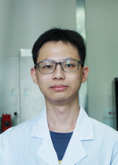
    

    

        

            <strong>Wenkai Fan</strong>
             Master's student
        

        

            Address: Bldg A2, Xili Campus
			 Email: 936418429 AT qq.com
        

        

            <strong><u>Academic Training</u></strong> 
			B.S., Biomedical Engineering, Shenzhen University (2019-2023)
        

    

	

    
<h2>Undergraduate Students</h2>

    

        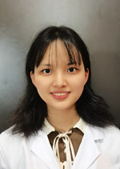
    

	

        

            <strong>Rui Deng</strong>
			 Undergrad student
        

        
 
            Address: Bldg A2, Xili Campus
			 Email: XX
        

        

            <strong><u>Academic Training</u></strong> 
			B.S., Biomedical Engineering, Shenzhen University (2021-present)
        

    

    

    
<h1>Alumni (Core members)</h1>

    

        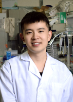
    
   
    

		

            <strong>Donghao Li</strong>
			 Master's Student (2020-2023)
			 Thesis: Point-of-care blood coagulation assay based on digital microfluidics
        

		

            Current posisition: Microfluidic engineer, Hangzhou TinkerBio
        

		
Email: 1459028206 AT qq.com

	

    

        
	

    

        

            <strong>Kai Wu</strong>
             Master's Student (2020-2023)
	         Thesis: Multiplex digital nucleic acid detection based on droplet pairing and color coding
        

		
Current posisition: Microfluidic engineer, Shenzhen YHLO Biotech

		
Email: wk13034005180 AT 163.com

	

    

        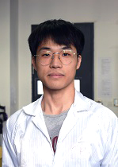
	

    

		

            <strong>Run Xie</strong>
			 Master's Student (2020-2023)
			 Thesis: High-throughput drug perturbation analysis based on droplet microfluidics and single-cell RNA sequencing
        

		
Current posisition: System engineer, Shenzhen YHLO Biotech

		
Email: run97999 AT 163.com

	

    

        
	

    

		

            <strong>Linzhe Chen</strong>
			 Master's Student (2019-2022)
             Thesis: Point-of-care testing based on droplet microfluidics
        

		
Current posisition: System engineer, Shenzhen Mai Ke Tian

		
Email: 18206692357 AT 163.com

    

    
    
        
	

    

		

            <strong>Lanzhu Huang</strong>
			 Master's Student (2018-2021)
			 Thesis:  Flexible Micropost Rings for High Throughput Testing of Clot Retraction Force
        

		
Current position: Research engineer, Shenzhen Pu Men

		
Email: huanglanzhu2018 AT email.szu.edu.cn

	

    

        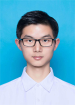
	

    

		

            <strong>Tao Wang</strong>
			 Master's Student, co-advised by Prof. Qiaoliang Li (2020-2021)
			 Thesis: Single Cell Isolation Using Droplet-based Microfluidics
        

		
Current position: System engineer, Shenzhen Mai Ke Tian 

	

    

        
	

    

		

            <strong>Nicolò (Nick) Simone Villa</strong>
			 PhD Candidate, co-advised by Prof. Tianfu Wang (2019-2020)
        

		
Current position: independent artist

		
Email: nicolos.villa AT gmail.com

	

    
<h1>Alumni (Undergrad researchers)</h1>

    

		

            <b>Yunzhu Wan</b> 
		    Final Year Project student, 2021-2022 
		    Current position: Master's student at Sun Yat-sen University
        

    	

            <b>Jieying Shan</b> 
		    Final Year Project student, 2021-2022 
		    Current position: Master's student at SZU
        

        

            <b>Jingyi Cai</b> 
		    Undergrad Research Assistant & Final Year Project student, 2019-2021 
            Current position: Master's student at SZU
        

        

            <b>Meichi Jin</b> 
	    	Final Year Project student, 2020-2021 
		    Current position: Master's student at ZidaLab at SZU
        

	

