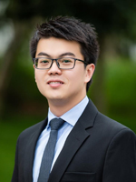
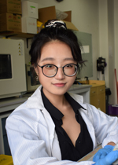
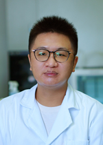
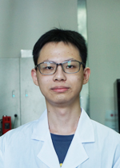
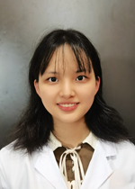
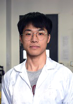
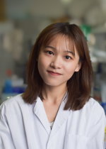

    
<h2>Principal Investigator</h2>

        

            
		

    

        
<strong>李自达</strong>, 博士 (<a href = "https://scholar.google.com/citations?user=9s8iCB0AAAAJ&amp;hl=en" target="_blank">Google Scholar</a> | <a href=".\docs\CV_Short.pdf" target="_blank">Short CV (Chinese)</a> | <a href=".\docs\CV_Full.pdf" target="_blank">Full CV</a>)

        
助理教授 深圳大学生物医学工程学院医学检验技术系 

        
<b>地址</b>: 中国深圳市学苑大道1066号A2栋425室 
        <b>联系方式</b>:      

    

    

        <h3>学术经历</h3>
        

            密歇根大学安娜堡分校 
            博士，机械工程系 (2013-2018) 
            导师：Prof. Jianping Fu
        

        

            香港大学 
			研究助理，机械工程系 (2012-2013) 
			导师：Prof. Anderson Ho Cheung Shum
        

        
 
            清华大学 
			交换生，航天航空学院 (2010-2011)
        

		

            中国科学技术大学 
			学士，热科学与能源工程系 (2008-2012) 
			导师：何立群老师、张海峰老师
        

        <h3>代表奖项</h3>
        

            优秀班主任；优秀本科教师，深圳大学（2022） 
			全国高校教师教学创新大赛三等奖，中国教育部（2021） 
			百篇优秀本科毕业论文指导教师，深圳大学（指导学生：金美池，2021） 
			教学单项奖-优秀本科教学组织管理奖，深圳大学（2020） 
			Baxter青年科学家（一等奖），Baxter Healthcare Inc. (2016)
        

        <h3>指导学生获奖</h3>
		

            全国大学生生物医学工程创新设计大赛三等奖，中国生物医学工程学会（2021） 
			研究生创新发展项目，深圳大学（2021） 
			省级大学生创新创业计划项目，深圳大学（2020，2021） 
			百篇优秀本科毕业论文，深圳大学（2021） 
        

	

	

    
<h2>研究生</h2>

	

        
	

	

        

            <strong>金美池</strong>
             M硕士研究生
        

        

            地址: 西丽校区A2楼
             Email: 2017222079 AT email.szu.edu.cn
        

        

            <strong><u>教育经历</u></strong> 
			深圳大学生物医学工程，学士（2017-2021）
        

        

            <strong><u>荣誉奖项</u></strong> 
			二等奖学金（2019，2020）；挑战杯校级特等奖（2019）；深圳大学百篇优秀本科毕业论文（Top 2%, 2021）；广东省挑战杯特等奖（2021）
        

	

    

        
    

    

        

            <strong>丁婧怡</strong>
             硕士研究生
        

        

            地址: 西丽校区A2楼
			 Email: dingjy99 AT 163.com
        

		

            <strong><u>教育经历</u></strong> 
			深圳大学生物医学工程，学士（2017-2021）
			 加州大学伯克利分校，交流项目（2020.1-2020.6）
        

	

    

        
    

    

        

            <strong>赵展陶</strong>
			 硕士研究生
        

        

            地址: 西丽校区A2楼
			 Email: 840801648 AT qq.com
        

		

            <strong><u>教育经历</u></strong> 
			广东医科大学生物医学工程，学士（2017-2021）
        

	

    

        
	

    

        

            <strong>方琪</strong>
			 硕士研究生
        

	    

            地址: 西丽校区A2楼
			 Email: 779574160 AT qq.com
        

	    

            <strong><u>教育经历</u></strong> 
			安徽医科大学生物医学工程，学士（2018-2022）
        

        

            <strong><u>荣誉奖项</u></strong> 
			进步奖学金（2020）；全国计算机设计大赛三等奖（2021）
        

    

    

        
    

    

        

            <strong>翟恒</strong>
			 硕士研究生
        

        

            地址: 西丽校区A2楼
			 Email: zhaiheng1998 AT outlook.com
        

	    

            <strong><u>教育经历</u></strong> 
			广东医科大学生物医学工程，学士（2017-2021）
        

    

    

        
    

    

        

            <strong>姚婉君</strong>
			 硕士研究生
        

	    

            地址: 西丽校区A2楼
			 Email: yaowanjun2000 AT 163.com
        

	    

            <strong><u>教育经历</u></strong> 
			浙江理工大学电子信息工程，学士（2018-2022）
        

	

    

        
	

    

        

            <strong>陈佳兆</strong>
             硕士研究生
        

		

            地址: 西丽校区A2楼
			 Email: cjz524611714 AT gmail.com
        

	    

            <strong><u>教育经历</u></strong> 
			深圳大学生物医学工程，学士（2019-2023）
        

	

    

        
    

    

        

            <strong>范文楷</strong>
             硕士研究生
        

        

            地址: 西丽校区A2楼
			 Email: 936418429 AT qq.com
        

        

            <strong><u>教育经历</u></strong> 
			深圳大学生物医学工程，学士（2019-2023）
        

    

	

    
<h2>本科生</h2>

    

        
    

	

        

            <strong>邓蕊</strong>
			 本科生
        

        
 
            地址: 西丽校区A2楼
			 Email: XX
        

        

            <strong><u>教育经历</u></strong> 
			深圳大学生物医学工程，学士（2021至今）
        

    

    

    
<h1>毕业生 (核心成员)</h1>

    

        
    
   
    

		

            <strong>李东豪</strong>
			 硕士研究生 (2020-2023)
			 毕业论文：《基于数字微流控技术的即时凝血检测新方法的研究》
        

		

            现在职位：杭州霆科生物科技有限公司，微流控工程师
        

		
Email: 1459028206 AT qq.com

        
<strong><u>荣誉奖项</u></strong> 
			二等奖学金（2020）；全国生物医学工程大赛三等奖（2021）；“荔园挑战”创新创业大赛特等奖（2021）；腾讯创新奖学金（2022；Top 2%）；活水奖学金（2023）；优秀硕士毕业生（2023）
        

	

    

        
	

    

        

            <strong>武凯</strong>
             硕士研究生 (2020-2023)
	         毕业论文：《基于液滴配对与颜色编码的多重数字核酸检测》
        

		
现在职位：深圳市亚辉龙生物科技股份有限公司，测序芯片微流控工程师

		
Email: wk13034005180 AT 163.com

        

            <strong><u>荣誉奖项</u></strong> 
			广东省生命健康研究生学术论坛-口头报告二等奖（2023）；优秀硕士毕业生（2023）
        

	

    

        
	

    

		

            <strong>谢润</strong>
			 硕士研究生 (2020-2023)
			 毕业论文：《基于液滴微流控与单细胞测序的高通量药物扰动分析新方法的研究》
        

		
现在职位：深圳市亚辉龙生物科技股份有限公司，系统工程师

		
Email: run97999 AT 163.com

        

            <strong><u>荣誉奖项</u></strong> 
			"荔园挑战"创新创业大赛二等奖（2020）
        

	

    

        
	

    

		

            <strong>陈琳喆</strong>
			 硕士研究生 (2019-2022)
             毕业论文：《基于液滴微流控的即时检测新方法的研究》
        

		
现在职位：深圳麦科田生物医疗技术股份有限公司，系统工程师

		
Email: 18206692357 AT 163.com

        

            <strong><u>荣誉奖项</u></strong> 
			特等奖学金（2019）；二等奖学金（2020）；研究生创新发展项目（2021）；活水奖学金（2022）；优秀硕士毕业生（2022）；深圳大学优秀研究生学位论文（2022；Top 2%）
        

    

    
    
        
	

    

		

            <strong>黄兰蛛</strong>
			 硕士研究生 (2018-2021)
			 毕业论文：《用于凝块收缩力高通量检测的柔性微柱环装置的研究》
        

		
现在职位：深圳普门科技股份有限公司，试剂研发工程师

		
Email: huanglanzhu2018 AT email.szu.edu.cn

        

            <strong><u>荣誉奖项</u></strong> 
			二等奖学金（2018, 2019）；一等奖学金（2020）
        

	

    

        
	

    

		

            <strong>汪涛</strong>
			 联合培养硕士研究生（李乔亮副教授）(2020-2021)
			 毕业论文：《基于液滴微流控的单细胞分离方法的研究》
        

		
现在职位：深圳麦科田生物医疗技术股份有限公司，系统工程师

	

    

        
	

    

		

            <strong>Nicolò (Nick) Simone Villa</strong>
			 博士研究生, co-advised by Prof. Tianfu Wang (2019-2020)
        

		
现在职位：自由创作艺术家

		
Email: nicolos.villa AT gmail.com

	

    
<h1>毕业生 (本科生)</h1>

    

		

            <b>万芸竹</b> 
		    毕设学生 (2021-2022) 
		    现在职位：中山大学硕士研究生 
            荣誉奖项：优秀毕业生（2022）
        

    	

            <b>单洁滢</b> 
		    毕设学生 (2021-2022) 
		    现在职位：深圳大学硕士研究生 
            荣誉奖项：优秀本科毕业设计（Top 20%, 2022）；优秀毕业生（2022）
        

        

            <b>蔡金颖</b> 
		    研究助理 & 毕设学生 (2019-2021) 
            现在职位：深圳大学硕士研究生 
            荣誉奖项：优秀本科毕业设计（Top 20%, 2021）
        

        

            <b>金美池</b> 
	    	毕设学生 (2020-2021) 
            现在职位：深圳大学硕士研究生（本课题组） 
		    荣誉奖项：广东省挑战杯特等奖（2021）；百佳本科毕业设计（Top 2%, 2021）；优秀毕业生（2021）
        

	

