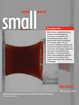
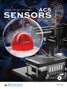
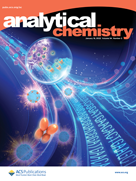
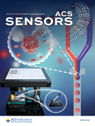

    <h3>Cover Images</h3>
    <ol reversed class="publication_list">
	

		
		
		
		
    

    </ol>

### Journal Papers

Note: #Co-first authors; *Corresponding author(s); <u>Underscore</u>: lab member/alumnus; **colored**: selected publications.

### ***<u>Ongoing Projects</u>***

4. **Project Bubble-Tea: Flow cytometry-compatible digital droplet PCR**  
   <u>Meichi Jin</u>, <u>Donghao Li</u>, <u>Zida Li</u>*, et al.  
3. **Project Free-Oligo: High throughput, multiplex single-cell chemical transcriptome profiling using single-cell RNA sequencing**  
   <u>Zhantao Zhao</u>, <u>Heng Zhai</u>, <u>Run Xie</u>, Ya Liu,* <u>Zida Li</u>*, et al.  
5. **Project TBD: scRNA-seq on scarce, sorted immune cells using high throughput methods**  
   <u>Zhantao Zhao</u>, <u>Heng Zhai</u>, <u>Zida Li</u>*, et al.  
1. **Project TBD: digital immunoassay using droplet microfluidics and intelligent computer vision**  
   Xiaoxiang Hu, <u>Qi Fang</u>, <u>Zida Li</u>*, Yujuan Chai*, et al.  

### ***<u>In Preparation/Submission</u>***

18. **Multiplex digital LAMP based on visual stratification of precipitates**  
    <u>Meichi Jin</u>,# <u>Jingyi Ding</u>,# <u>Zida Li</u>*, et al.  
    **###** , manuscript in preparation  
    [DOI]() | [PDF]()
17. Image-activated pico-injection for single cell analysis  
    Zhantao Zhao, Heng Zhai, Peng Zuo, Tao Wang, Run Xie, Mu Tian, Ruyuan Song, Xiaonan Xu, and Zida Li*  
    **###** , under review  
    [DOI]() | [PDF]()

### ***<u>2023</u>***

16. **High resolution, multiplex antibody patterning using micropillar-focused droplet printing and microcontact printing**  
    <u>Meichi Jin</u>, <u>Kai Wu</u>, Mengzhen Wang, Yang Zhang, Chengbin Yang, and <u>Zida Li</u>*  
    **_Advanced Biology_** , in press  
    [DOI](https://doi.org/10.1002/adbi.202300111) | [PDF]()  
15. **CoID-LAMP: Color-encoded, intelligent digital LAMP for multiplexed nucleic acid quantification**  
    <u>Kai Wu</u>,# <u>Qi Fang</u>,# <u>Zhantao Zhao</u>, and <u>Zida Li</u>*  
    **_Analytical Chemistry_** , 95(11), 5069–5078, 2023  
    [DOI](https://doi.org/10.1021/acs.analchem.2c05665) | [PDF]()  
14. **Combinatorial perturbation sequencing on single cells using microwell-based droplet random pairing**  
    <u>Run Xie</u>,# Yang Liu,# Shiyu Wang, Xuyang Shi, <u>Zhantao Zhao</u>, Longqi Liu, Ya Liu,* and <u>Zida Li</u>*  
    **_Biosensors and Bioelectronics_** , 220, 114913, 2023  
    [DOI](https://doi.org/10.1016/j.bios.2022.114913) | [PDF]()  
13. **Bone-on-a-chip platforms and integrated biosensors: towards advanced in vitro bone models with real-time biosensing**  
    Yang Zhang, Taozhao Yu, <u>Jingyi Ding</u>, and <u>Zida Li</u>*  
    **_Biosensors and Bioelectronics_** , 219, 114798, 2023  
    [DOI](https://doi.org/10.1016/j.bios.2022.114798) | [PDF](file/2023_BIOS_Zhang.pdf)  
  
### ***<u>2022</u>***
  
12. **Point-of-care blood coagulation assay based on dynamic monitoring of blood viscosity using droplet microfluidics**    
    <u>Linzhe Chen</u>, <u>Donghao Li</u>, Xinyu Liu, Yihan Xie, Jieying Shan, Haofan Huang, Xiaxia Yu, Yudan Chen, Weidong Zheng, and <u>Zida Li</u>*  
    **_ACS Sensors_** , 7(8), 2170–2177, 2022  
    [DOI](https://doi.org/10.1021/acssensors.1c02360) | [PDF](file/2022_ACSSensors_Chen.pdf)  
    * Selected as [Front Cover story](https://pubs.acs.org/toc/ascefj/7/8) by ACS Sensors.     
11. **Generation and Screening of Antigen-Specific Nanobodies from Mammalian Cells Expressing the BCR Repertoire Library Using Droplet-Based Microfluidics**  
    Menghua Lyu,# Xuyang Shi,# Xiaopan Liu,# Yang Liu, Xijun Zhu, Lijuan Liao, Hongyan Zhao, Na Sun, Shiyu Wang, <u>Linzhe Chen</u>, Linyuan Fan, Qumiao Xu, Qianqian Zhu, Kai Gao, Huaying Chen, Yonggang Zhu, Zida Li, Weijin Guo, Yue Zheng, Yue Zheng, Ying Gu, Longqi Liu,* Meiniang Wang,* and Ya Liu*  
    **_Analytical Chemistry_** , 94(22), 7970–7980, 2022  
    [DOI](https://doi.org/10.1021/acs.analchem.2c00865) | [PDF](file/2022_AC_Lyu.pdf)  
10. **Point-of-care blood coagulation assay enabled by printed circuit board-based digital microfluidics**    
    <u>Donghao Li</u>,# Xinyu Liu,# Yujuan Chai,# Jieying Shan, Yihan Xie, Yong Liang, Susu Huang, Weidong Zheng, and <u>Zida Li</u>*  
    **_Lab on a Chip_** , 22(4), 709-716, 2022  
    [DOI](https://doi.org/10.1039/D1LC00981H) | [PDF](file/2022_LabChip_Li.pdf)  
9. **deep-dLAMP: deep learning-enabled polydisperse emulsion-based digital loop-mediated isothermal amplification**    
     <u>Linzhe Chen</u>,# <u>Jingyi Ding</u>,# Hao Yuan, Chi Chen,* and <u>Zida Li</u>*  
     **_Advanced Science_** , 9(9), 2105450, 2022  
     [DOI](https://doi.org/10.1002/advs.202105450) | [PDF](file/2022_AdvSci_Chen.pdf)  
8. **Single-cell sequencing to unveil the mystery of embryonic development**   
     <u>Zida Li</u>,#,* Feng Lin,# Chu-Han Zhong, Shue Wang, Xufeng Xue, and Yue Shao*  
     **_Advanced Biology_** , 6(2), 2101151, 2022  
     [DOI](https://doi.org/10.1002/adbi.202101151) | [PDF](file/2021_AdvBio_Li.pdf)  
7. **High-throughput functional screening of antigen-specific T-cells based on droplet microfluidics on single-cell level**  
     Shiyu Wang,# Yang Liu,# Yijian Li, Menghua Lv, Kai Gao, Ying He, Wenbo Wei, Yonggang Zhu, Xuan Dong, Xun Xu, <u>Zida Li</u>,* Longqi Liu,* and Ya Liu*  
     **_Analytical Chemistry_** , 94(2), 918–926, 2022  
     [DOI](https://doi.org/10.1021/acs.analchem.1c03678) | [PDF](file/2021_AC_Wang.pdf)  
     * Selected as [Front Cover story](https://pubs.acs.org/toc/ancham/94/2) by Analytical Chemistry.  
 
### ***<u>2021</u>***

6. **Emerging biosensing technologies for improved diagnostics of COVID-19 and future pandemics**  
    <u>Linzhe Chen</u>, Guoliang Zhang, Longqi Liu*, and <u>Zida Li</u>*  
    **_Talanta_** , 225, 121986, 2021  
    [DOI](https://doi.org/10.1016/j.talanta.2020.121986) | [PDF](file/2020_Talanta_Chen.pdf)  

### ***<u>2020</u>***

5. **Micro-engineered flexural post rings for effective blood sample fencing and high throughput measurement of clot retraction force**
    <u>Lanzhu Huang</u>,# Xinyu Liu,# Yuanbin Ou, Haofan Huang, Xia Zhang, Yize Wang, Yong Liang, Xiaxia Yu, Weidong Zheng, Huisheng Zhang, and <u>Zida Li</u>*
    **_ACS Sensors_** , 5(12), 3949-3955, 2020
    [DOI](https://doi.org/10.1021/acssensors.0c01596) | [PDF](file/2020_ACSSensors_Huang.pdf****)
    * Selected as [Front Cover](https://pubs.acs.org/toc/ascefj/5/12) story by ACS Sensors.  
    * Highlighted in [Introducing Our Authors](https://pubs.acs.org/doi/10.1021/acssensors.0c02540) by ACS Sensors.  
    * Highlighted by American Chemical Society with a [WeChat post](https://mp.weixin.qq.com/s/qQzuq_yrzEEAxaOvwn4UEw) .  
4. **Recent advances in solar-driven evaporation system**  
    Zhourui Xu, <u>Zida Li</u>, Yihang Jiang, Gaixia Xu, Mingwei Zhu, Wing-Cheung Law, Ken-Tye Yong, Yanshuai Wang, Chengbin Yang, Biqin Dong, and Feng Xing*
    **_Journal of Materials Chemistry A_** , 8, 25571-25600, 2020  
    [DOI](https://doi.org/10.1039/D0TA08869B) | [PDF](file/2020_JMCA_Xu.pdf)  
3. **Stretchable supercapacitors as emergent energy storage units for health monitoring bioelectronics**  
    Xue Chen, <u>Nicolo Simone Villa</u>, Yanfeng Zhuang, <u>Linzhe Chen</u>, Tianfu Wang, <u>Zida Li</u>*, and Tiantian Kong*  
    **_Advanced Energy Materials**_ , 10(4), 1902769, 2020  
    [DOI](https://doi.org/10.1002/aenm.201902769) | [PDF](file/2019_AEM_Chen.pdf****)  
    * Highlighted on MaterialsViews China (Wiley) [blog](https://www.materialsviewschina.com/2019/12/41989/) and [WeChat post](https://mp.weixin.qq.com/s/VdvMGZI9edK0IKfQiKunRw).  

### ***<u>2019</u>***

2. **Dean flow assisted single cell and bead encapsulation for high performance single cell expression profiling**  
    Luoquan Li,# Ping Wu,# Zhaofeng Luo, Lei Wang, Weiping Ding, Tao Wu, Jinyu Chen, Jinlong He, Yi He, Heran Wang, Ying Chen, Guibo Li, <u>Zida Li</u>,* and Liqun He*  
    **_ACS Sensors_** , 4(5), 1299-1305, 2019  
    [DOI](https://doi.org/10.1021/acssensors.9b00171) | [PDF](file/2019_ACSSensors_Li.pdf)  
1. **Multiple splitting of droplets using multi-furcating microfluidic channels**  
    <u>Zida Li</u>*, Luoquan Li, Meixiang Liao, Liqun He, and Ping Wu*  
    **_Biomicrofluidics_** , 13(2), 024112, 2019   
    [DOI](https://doi.org/10.1063/1.5086716) | [PDF](file/2019_BMF_Li.pdf)  

### ***<u>Before SZU</u>***

14. **Controlled modeling of human epiblast and amnion development using stem cells**  
    Yi Zheng, Xufeng Xue, Yue Shao, Sicong Wang, Sajedeh Nasr Esfahani, <u>Zida Li</u>, Jonathon M. Muncie, Johnathon N. Lakins, Valerie M. Weaver, Deborah L. Gumucio, and Jianping Fu*  
    **_Nature_** , 573(7774), 421-425, 2019  
    [DOI](https://doi.org/10.1038/s41586-019-1535-2) | [PDF](file) | [Media Coverage](https://mp.weixin.qq.com/s/4BWEXUtSn-XoQEGYUgn6Aw)  
15. **Dorsal-ventral patterned neural cyst from human pluripotent stem cells in a neurogenic niche**  
    Yuanyuan Zheng,# Xufeng Xue,# Agnes M. Resto Irizarry, <u>Zida Li</u>, Yue Shao, Yi Zheng, Gang Zhao,* and Jianping Fu*  
    **_Science Advances_** , 5(12), eaax5993, 2019  
    [DOI](https://doi.org/10.1126/sciadv.aax5933) | [PDF](file/2019_SciAdv_Zheng.pdf)  
16. **Microengineered human amniotic ectoderm tissue array for high-content developmental phenotyping**  
    Sajedeh Nasr Esfahani, Yue Shao, Agnes M Resto Irizarry, <u>Zida Li</u>, Xufeng Xue, Deborah L Gumucio, and Jianping Fu*  
    **_Biomaterials_** , 216, 119244, 2019  
    [DOI](https://doi.org/10.1016/j.biomaterials.2019.119244) | [PDF](file/2019_Biomaterials_Esfahani.pdf)   
17. **Biophysical phenotypes and determinants of anterior vs. posterior primitive streak cells derived from human pluripotent stem cells**  
    Feng Lin, Yue Shao, Xufeng Xue, Yi Zheng, <u>Zida Li</u>, Chunyang Xiong*, and Jianping Fu*  
    **_Acta Biomaterialia_** , 86, 125-134, 2019  
    [DOI](https://doi.org/10.1016/j.actbio.2019.01.017) | [PDF](file/2019_ActaBiomaterialia_Lin.pdf)  
18. **Carbon nanotube strain sensor based hemoretractometer for blood coagulation testing**  
    <u>Zida Li</u>, Yize Wang, Xufeng Xue, Brendan McCracken, Kevin Ward, and Jianping Fu*  
    **_ACS Sensors_** , 3(3), 670-676, 2018  
    [DOI](https://doi.org/10.1021/acssensors.7b00971) | [PDF](file/2018_ACSSensors_Li.pdf)  
19. **Capillary assisted deposition of carbon nanotube film for strain sensing**  
     <u>Zida Li</u>, Xufeng Xue, Feng Lin, Yize Wang, Kevin Ward, and Jianping Fu*  
     **_Applied Physics Letters_** , 111(17), 173105, 2017  
     [DOI](https://doi.org/10.1063/1.5001754) | [PDF](file/2017_APL_Li.pdf)  
20. **Tracking the tumor invasion front using long-term fluidic tumoroid culture**  
     Koh Meng Aw Yong, <u>Zida Li</u>, Sofia D. Merajver, and Jianping Fu*  
     **_Scientific Reports_** , 7, 2017  
     [DOI](https://doi.org/10.1038/s41598-017-10874-1) | [PDF](file/2017_SciRep_KM.pdf)   
21. **Acoustic tweezing cytometry enhances osteogenesis of human mesenchymal stem cells through cytoskeletal contractility and YAP activation**  
     Xuefeng Xue, Xiaowei Hong, <u>Zida Li</u>, Cheri X. Deng, and Jianping Fu*  
     **_Biomaterials_** , 134, 22-30, 2017    
     [DOI](https://doi.org/10.1016/j.biomaterials.2017.04.039) | [PDF](file/2017_Biomaterials_Xue.pdf)  
22. **Controlled tubular unit formation from collagen film for modular tissue engineering**  
     Jianming Sang, Xiang Li, Yue Shao, <u>Zida Li</u>, and Jianping Fu*  
     **_ACS Biomaterials Science & Engineering_** , 3 (11), 2860-2868, 2016  
     [DOI](https://doi.org/10.1021/acsbiomaterials.6b00468) | [PDF](file/2016_ACSBiomaterials_Sang.pdf)  
23. **A miniaturized hemoretractometer for blood clot retraction testing**  
     <u>Zida Li</u>, Xiang Li, Brendan McCracken, Yue Shao, Kevin Ward, and Jianping Fu*  
     **_Small_** , 12, 3926–3934, 2016  
     [DOI](https://doi.org/10.1002/smll.201600274) | [PDF](file/2016_Small_Li.pdf)  
     * Selected as [Frontispiece story](https://onlinelibrary.wiley.com/doi/abs/10.1002/smll.201670144) by Small.  
24. **Musical interfaces: visualization and reconstruction of music with a microfluidic two-phase flow**  
     Sze Yi Mak, <u>Zida Li</u>, Arnaud Frere, Tat Chuen Chan, and Ho Cheung Shum*  
     **_Scientific Reports_** , 4, 6675, 2014  
     [DOI](https://doi.org/10.1038/srep06675) | [PDF](file/2014_SciRep_Mak.pdf)  
25. **Syringe-pump-induced fluctuation in all-aqueous microfluidic system implications for flow rate accuracy**  
     <u>Zida Li</u>, Sze Yi Mak, Alban Sauret, and Ho Cheung Shum*  
     **_Lab on a Chip_** , 14(4), 744-749, 2014    
     [DOI](https://doi.org/10.1039/c3lc51176f) | [PDF](file/2014_LabChip_Li.pdf)  
26. **Emerging microengineered tools for functional analysis and phenotyping of blood cells**  
     Xiang Li, Weiqiang Chen, <u>Zida Li</u>, Ling Li, Hongchen Gu, and Jianping Fu*  
     **_Trends in Biotechnology_** , 32(11), 586-594, 2014  
     [DOI](https://doi.org/10.1016/j.tibtech.2014.09.003) | [PDF](file/2014_TrendsInBiotech_Li.pdf)    
27. **Dynamics for dense packing of colloids**  
     Liqun He*, Ping Wu, <u>Zida Li</u>, and Lili Feng  
     **_Advanced Materials Research_** , 165, 248-254, 2012  
     [DOI](https://doi.org/10.4028/www.scientific.net/AMR.465.248) | [PDF](file/2012_AdvMatRes_He.pdf)  
  
### ***<u>Book Chapters</u>***

1. **Nanotechnology and microfluidics for biosensing and biophysical property assessment: implications for next generation in vitro diagnostics**  
    <u>Zida Li</u>* and Anderson Ho Cheung Shum*  
    **_Nanotechnology and Microfluidics_**, edited by Xingyu Jiang, Chunli Bai, and Minghua Liu , 83-107, John Wiley & Sons, 2019  
    [DOI](https://doi.org/10.1002/9783527818341.ch3) | [PDF](file/2019_NanoAndMicrofluidics_Li.pdf)  

### ***<u>Patents</u>***

8. **A nucleic acid quantification method based on non-uniform droplets and image analysis**  
    <u>Zida Li</u>, <u>Jingyi Ding</u>, <u>Linzhe Chen</u>, and Chi Chen  
    _China Invention Patent Provisional Application_ , CN114540469A, 2022  
7. **A detection system and method for point-of-care blood clotting function assessment**  
    <u>Zida Li</u>, <u>Donghao Li</u>, Yujuan Chai, Xinyu Liu, and Weidong Zheng  
    _China Invention Patent Provisional Application_ , CN114441780A, 2022  
6. A device and method for the assessement of blood viscosity using microfluidics  
    <u>Zida Li</u>, <u>Linzhe Chen</u>, Weidong Zheng, Jieying Shan, Yihan Xie, and Xinyu Liu  
    China Invention Patent Provisional Application , CN113504153A, 2021  
5. **A system and method for single cell isolation using droplet microfluidics**  
    <u>Zida Li</u>, <u>Tao Wang</u>, Yongjin Zhou, and Zengtong Chen  
    _China Invention Patent Provisional Application_ , CN113477282A, 2021  
4. **Simulation system and method of in vitro diagnostics**  
    <u>Zida Li</u>, Xiaxia Yu, Xinyu Liu, Jieying Shan, and Yihan Xie  
    _China Invention Patent Application_ ,ZL202110750662.0，2023  
3. **A fabrication method and application of soft post rings for clot retraction testing**  
    <u>Zida Li</u>, <u>Lanzhu Huang</u>, and Weidong Zheng  
    _China Invention Patent Application_ , ZL202010260648.8, 2022  
2. **A microscale device for blood coagulation assay**  
    Jianping Fu, Kevin Ward, <u>Zida Li</u>, and Xiang Li  
    _U.S. Patent Application_ , 62/304,385, 2018  
1. **System and method for generation of emulsions with low interfacial tension and measuring frequency vibrations in the system**  
    Ho Cheung Shum, Alban Sauret, <u>Zida Li</u>, and Yang Song  
    _U.S. Patent Application_ , 13/839,072, 2013  