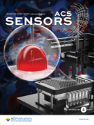
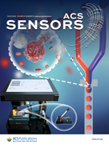

<h3>期刊封面</h3>
<ol reversed class="publication_list">
    

        
        
        
        
    

</ol>

<h3>期刊论文</h3>
<ol reversed class="publication_list">
    
注：#共同第一作者; *（共同）通讯作者; <u>下划线</u>：课题组成员/校友；<b>加色</b>：代表成果。

    <h3><u><i>Ongoing Projects</i></u></h3>
    <li><b>Project Bubble-Tea: Flow cytometry-compatible digital droplet PCR
        </b> <u>Meichi Jin</u>, <u>Donghao Li</u>, <u>Zida Li</u>*, et al.
    </li>
    <li><b>Project Snowflake: Image analysis-based multiplexed droplet digital LAMP
        </b> <u>Meichi Jin</u>, <u>Jingyi Ding</u>, <u>Zida Li</u>*, et al.
    </li>
    <li><b>Project Free-Oligo: High throughput, multiplex single-cell chemical transcriptome profiling using single-cell RNA sequencing
        </b> <u>Run Xie</u>, Yang Liu, Shiyu Wang, Ya Liu,* <u>Zida Li</u>*, et al.
    </li>
</ol>

<ol reversed class="publication_list">
    <h3><u><i>In Preparation/Submission</i></u></h3>
    <li><b>Image-activated pico-injection for single cell analysis
        </b> <u>Zhantao Zhao</u>, <u>Heng Zhai</u>, Peng Zuo, <u>Tao Wang</u>, <u>Run Xie</u>, Mu Tian, Ruyuan Song, Xiaonan Xu, and <u>Zida Li</u>*
         <i><b>###</b>
        </i>, under review
         <a href="">DOI</a> | <a href="file/">PDF</a>
    </li>
    <h3><u><i>2023</i></u></h3>
    <li><b>High resolution, multiplex antibody patterning using micropillar-focused droplet printing and microcontact printing
        </b> <u>Meichi Jin</u>, <u>Kai Wu</u>, Mengzhen Wang, Yang Zhang, Chengbin Yang, and <u>Zida Li</u>*
         <i><b>Advanced Biology</b>
        </i>, in press
         <a href="https://doi.org/10.1002/adbi.202300111">DOI</a> | <a href="file/">PDF</a>
    </li>
    <li><b>CoID-LAMP: Color-encoded, intelligent digital LAMP for multiplexed nucleic acid quantification
        </b> <u>Kai Wu</u>,# <u>Qi Fang</u>,# <u>Zhantao Zhao</u>, and <u>Zida Li</u>*
         <i><b>Analytical Chemistry</b>
        </i>, 95(11), 5069–5078, 2023
         <a href="https://doi.org/10.1021/acs.analchem.2c05665">DOI</a> | <a href="file/">PDF</a>
    </li>
    <li><b>Combinatorial perturbation sequencing on single cells using microwell-based droplet random pairing
        </b> <u>Run Xie,</u># Yang Liu,# Shiyu Wang, Xuyang Shi, <u>Zhantao Zhao</u>, Longqi Liu, Ya Liu,* and <u>Zida Li</u>*
         <i><b>Biosensors and Bioelectronics</b>
        </i>, 220, 114913, 2023
          <a href="https://doi.org/10.1016/j.bios.2022.114913">DOI</a> | <a href="file/">PDF</a>
    </li>
    <li><b>Bone-on-a-chip platforms and integrated biosensors: towards advanced <i>in vitro</i> bone models with real-time biosensing
        </b> Yang Zhang, Taozhao Yu, <u>Jingyi Ding</u>, and <u>Zida Li</u>*
         <i><b>Biosensors and Bioelectronics</b>
        </i>, 219, 114798, 2023
         <a href="https://doi.org/10.1016/j.bios.2022.114798">DOI</a> | <a href="file/2023_BIOS_Zhang.pdf">PDF</a>
    </li>
    <h3><u><i>2022</i></u></h3>
    <li><b>Point-of-care blood coagulation assay based on dynamic monitoring of blood viscosity using droplet microfluidics</b>
         <u>Linzhe Chen</u>, <u>Donghao Li</u>, Xinyu Liu, Yihan Xie, Jieying Shan, Haofan Huang, Xiaxia Yu, Yudan Chen, Weidong Zheng, and <u>Zida Li</u>*
         <i><b>ACS Sensors</b>
        </i>, 7(8), 2170–2177, 2022
         <a href="https://doi.org/10.1021/acssensors.1c02360">DOI</a> | <a href="file/2022_ACSSensors_Chen.pdf">PDF</a>
        <ul>
            <li>Selected as <a href="https://pubs.acs.org/toc/ascefj/7/8">Front Cover story </a> by <i>ACS Sensors</i>.</li>
        </ul>
    </li>
    <li><b>Generation and Screening of Antigen-Specific Nanobodies from Mammalian Cells Expressing the BCR Repertoire Library Using Droplet-Based Microfluidics
        </b> Menghua Lyu,# Xuyang Shi,# Xiaopan Liu,# Yang Liu, Xijun Zhu, Lijuan Liao, Hongyan Zhao, Na Sun, Shiyu Wang, <u>Linzhe Chen</u>, Linyuan Fan, Qumiao Xu, Qianqian Zhu, Kai Gao, Huaying Chen, Yonggang Zhu, <u>Zida Li</u>, Weijin Guo, Yue Zheng, Yue Zheng, Ying Gu, Longqi Liu,* Meiniang Wang,* and Ya Liu*
         <i><b>Analytical Chemistry</b>
        </i>, 94(22), 7970–7980, 2022
         <a href="https://doi.org/10.1021/acs.analchem.2c00865">DOI</a> | <a href="file/2022_AC_Lyu.pdf">PDF</a>
    </li>
    <li><b>Point-of-care blood coagulation assay enabled by printed circuit board-based digital microfluidics
        </b> <u>Donghao Li,</u># Xinyu Liu,# Yujuan Chai,# Jieying Shan, Yihan Xie, Yong Liang, Susu Huang, Weidong Zheng, and <u>Zida Li</u>*
         <i><b>Lab on a Chip</b>
        </i>, 22(4), 709-716, 2022
	     <a href="https://doi.org/10.1039/D1LC00981H">DOI</a> | <a href="file/2022_LabChip_Li.pdf">PDF</a>
    </li>
    <li><b>deep-dLAMP: deep learning-enabled polydisperse emulsion-based digital loop-mediated isothermal amplification 
        </b> <u>Linzhe Chen,</u># <u>Jingyi Ding,</u># Hao Yuan, Chi Chen,* and <u>Zida Li</u>*
         <i><b>Advanced Science</b>
        </i>, 9(9), 2105450, 2022
         <a href="https://doi.org/10.1002/advs.202105450">DOI</a> | <a href="file/2022_AdvSci_Chen.pdf">PDF</a>
    </li>
    <li><b>Single-cell sequencing to unveil the mystery of embryonic development
        </b> <u>Zida Li,</u>#,* Feng Lin,# Chu-Han Zhong, Shue Wang, Xufeng Xue, and Yue Shao*
         <i><b>Advanced Biology</b>
        </i>, 6(2), 2101151, 2022
         <a href="https://doi.org/10.1002/adbi.202101151">DOI</a> | <a href="file/2021_AdvBio_Li.pdf">PDF</a>
        </li>
    <li><b>High-throughput functional screening of antigen-specific T-cells based on droplet microfluidics on single-cell level
        </b> Shiyu Wang,# Yang Liu,# Yijian Li, Menghua Lv, Kai Gao, Ying He, Wenbo Wei, Yonggang Zhu, Xuan Dong, Xun Xu, <u>Zida Li</u>,* Longqi Liu,* and Ya Liu*
         <i><b>Analytical Chemistry</b>
        </i>, 94(2), 918–926, 2022
         <a href="https://doi.org/10.1021/acs.analchem.1c03678">DOI</a> | <a href="file/2021_AC_Wang.pdf">PDF</a>
        <ul>
            <li>Selected as <a href="https://pubs.acs.org/toc/ancham/94/2">Front Cover story </a> by <i>Analytical Chemistry</i>.</li>
        </ul>
    </li>
    <h3><u><i>2021</i></u></h3>
    <li><b>Emerging biosensing technologies for improved diagnostics of COVID-19 and future pandemics
        </b> <u>Linzhe Chen</u>, Guoliang Zhang, Longqi Liu*, and <u>Zida Li</u>*
         <i><b>Talanta</b>
        </i>, 225, 121986, 2021
         <a href="https://doi.org/10.1016/j.talanta.2020.121986">DOI</a> | <a href="file/2020_Talanta_Chen.pdf">PDF</a>
    </li>
    <h3><u><i>2020</i></u></h3>
    <li><b>Micro-engineered flexural post rings for effective blood sample fencing and high throughput measurement of clot retraction force
        </b> <u>Lanzhu Huang</u>,# Xinyu Liu,# Yuanbin Ou, Haofan Huang, Xia Zhang, Yize Wang, Yong Liang, Xiaxia Yu, Weidong Zheng, Huisheng Zhang, and <u>Zida Li</u>*
         <i><b>ACS Sensors</b>
        </i>, 5(12), 3949-3955, 2020
         <a href="https://doi.org/10.1021/acssensors.0c01596">DOI</a> | <a href="file/2020_ACSSensors_Huang.pdf">PDF</a>
        <ul>
            <li>Selected as <a href="https://pubs.acs.org/toc/ascefj/5/12">Front Cover story </a> by <i>ACS Sensors</i>.</li>
            <li>Highlighted in <a href="https://pubs.acs.org/doi/10.1021/acssensors.0c02540">Introducing Our Authors</a> by <i>ACS Sensors</i>.</li>
		    <li>Highlighted by American Chemical Society with a <a href="https://mp.weixin.qq.com/s/qQzuq_yrzEEAxaOvwn4UEw">WeChat post </a>.</li>
        </ul>
    </li>
    <li><b>Recent advances in solar-driven evaporation system
        </b> Zhourui Xu, <u>Zida Li</u>, Yihang Jiang, Gaixia Xu, Mingwei Zhu, Wing-Cheung Law, Ken-Tye Yong, Yanshuai Wang, Chengbin Yang, Biqin Dong, and Feng Xing*
         <i><b>Journal of Materials Chemistry A</b>
	    </i>, 8, 25571-25600, 2020
	     <a href="https://doi.org/10.1039/D0TA08869B">DOI</a> | <a href="file/2020_JMCA_Xu.pdf">PDF</a>
    </li>
    <li><b>Stretchable supercapacitors as emergent energy storage units for health monitoring bioelectronics
        </b> Xue Chen, <u>Nicolo Simone Villa</u>, Yanfeng Zhuang, <u>Linzhe Chen</u>, Tianfu Wang, <u>Zida Li</u>*, and Tiantian Kong*
         <i><b>Advanced Energy Materials</b>
        </i>, 10(4), 1902769, 2020
         <a href="https://doi.org/10.1002/aenm.201902769">DOI</a> | <a href="file/2019_AEM_Chen.pdf">PDF</a>
        <ul>
            <li>Highlighted on MaterialsViews China (Wiley) <a href="https://www.materialsviewschina.com/2019/12/41989/">blog</a> and <a href="https://mp.weixin.qq.com/s/VdvMGZI9edK0IKfQiKunRw">WeChat post</a>.
		    </li>
        </ul>
    </li>
    <h3><u><i>2019</i></u></h3>
        <li><b>Dean flow assisted single cell and bead encapsulation for high performance single cell expression profiling
        </b> Luoquan Li,# Ping Wu,# Zhaofeng Luo, Lei Wang, Weiping Ding, Tao Wu, Jinyu Chen, Jinlong He, Yi He, Heran Wang, Ying Chen, Guibo Li, <u>Zida Li</u>,* and Liqun He*
         <i><b>ACS Sensors</b>
        </i>, 4(5), 1299-1305, 2019
         <a href="https://doi.org/10.1021/acssensors.9b00171">DOI</a> | <a href="file/2019_ACSSensors_Li.pdf">PDF</a>
    </li>
    <li><b>Multiple splitting of droplets using multi-furcating microfluidic channels
        </b> <u>Zida Li</u>*, Luoquan Li, Meixiang Liao, Liqun He, and Ping Wu*
         <i><b>Biomicrofluidics</b>
        </i>, 13(2), 024112, 2019
         <a href="https://doi.org/10.1063/1.5086716">DOI</a> | <a href="file/2019_BMF_Li.pdf">PDF</a>
    </li>
</ol>

<h3><u><i>Before SZU</i></u></h3>

<ol reversed class="publication_list">
    <li><b>Controlled modeling of human epiblast and amnion development using stem cells
        </b> Yi Zheng, Xufeng Xue, Yue Shao, Sicong Wang, Sajedeh Nasr Esfahani, <u>Zida Li</u>, Jonathon M. Muncie, Johnathon N. Lakins, Valerie M. Weaver, Deborah L. Gumucio, and Jianping Fu*
         <i><b>Nature</b>
	    </i>, 573(7774), 421-425, 2019
	     <a href="https://doi.org/10.1038/s41586-019-1535-2">DOI</a> | PDF | <a href="https://mp.weixin.qq.com/s/4BWEXUtSn-XoQEGYUgn6Aw">Media Coverage</a>
    </li>
    <li><b>Dorsal-ventral patterned neural cyst from human pluripotent stem cells in a neurogenic niche
        </b> Yuanyuan Zheng,# Xufeng Xue,# Agnes M. Resto Irizarry, <u>Zida Li</u>, Yue Shao, Yi Zheng, Gang Zhao,* and Jianping Fu*
	     <i><b>Science Advances</b>
	    </i>, 5(12), eaax5993, 2019
	     <a href="https://doi.org/10.1126/sciadv.aax5933">DOI</a> | <a href="file/2019_SciAdv_Zheng.pdf">PDF</a>
    </li>
    <li><b>Microengineered human amniotic ectoderm tissue array for high-content developmental phenotyping
        </b> Sajedeh Nasr Esfahani, Yue Shao, Agnes M Resto Irizarry, <u>Zida Li</u>, Xufeng Xue, Deborah L Gumucio, and Jianping Fu*
         <i><b>Biomaterials</b>
        </i>, 216, 119244, 2019
         <a href="https://doi.org/10.1016/j.biomaterials.2019.119244">DOI</a> | <a href="file/2019_Biomaterials_Esfahani.pdf">PDF</a>
    </li>
    <li><b>Biophysical phenotypes and determinants of anterior vs. posterior primitive streak cells derived from human pluripotent stem cells
        </b> Feng Lin, Yue Shao, Xufeng Xue, Yi Zheng, <u>Zida Li</u>, Chunyang Xiong*, and Jianping Fu*
         <i><b>Acta Biomaterialia</b>
        </i>, 86, 125-134, 2019
         <a href="https://doi.org/10.1016/j.actbio.2019.01.017">DOI</a> | <a href="file/2019_ActaBiomaterialia_Lin.pdf">PDF</a>
    </li>
    <li><b>Carbon nanotube strain sensor based hemoretractometer for blood coagulation testing
        </b> <u>Zida Li</u>, Yize Wang, Xufeng Xue, Brendan McCracken, Kevin Ward, and Jianping Fu*
         <i><b>ACS Sensors</b>
        </i>, 3(3), 670-676, 2018
         <a href="https://doi.org/10.1021/acssensors.7b00971">DOI</a> | <a href="file/2018_ACSSensors_Li.pdf">PDF</a>
    </li>
    <li><b>Capillary assisted deposition of carbon nanotube film for strain sensing
        </b> <u>Zida Li</u>, Xufeng Xue, Feng Lin, Yize Wang, Kevin Ward, and Jianping Fu*
         <i><b>Applied Physics Letters</b>
        </i>, 111(17), 173105, 2017
         <a href="https://doi.org/10.1063/1.5001754">DOI</a> | <a href="file/2017_APL_Li.pdf">PDF</a>
    </li>
    <li><b>Tracking the tumor invasion front using long-term fluidic tumoroid culture
        </b> Koh Meng Aw Yong, <u>Zida Li</u>, Sofia D. Merajver, and Jianping Fu*
         <i><b>Scientific Reports</b>
        </i>, 7, 2017
         <a href="https://doi.org/10.1038/s41598-017-10874-1">DOI</a> | <a href="file/2017_SciRep_KM.pdf">PDF</a>
    </li>
    <li><b>Acoustic tweezing cytometry enhances osteogenesis of human mesenchymal stem cells through cytoskeletal contractility and YAP activation
        </b> Xuefeng Xue, Xiaowei Hong, <u>Zida Li</u>, Cheri X. Deng, and Jianping Fu*
         <i><b>Biomaterials</b>
        </i>, 134, 22-30, 2017
         <a href="https://doi.org/10.1016/j.biomaterials.2017.04.039">DOI</a> | <a href="file/2017_Biomaterials_Xue.pdf">PDF</a>
    </li>
    <li><b>Controlled tubular unit formation from collagen film for modular tissue engineering
        </b> Jianming Sang,  Xiang Li, Yue Shao, <u>Zida Li</u>, and Jianping Fu*
         <i><b>ACS Biomaterials Science & Engineering</b>
        </i>, 3 (11), 2860-2868, 2016
         <a href="https://doi.org/10.1021/acsbiomaterials.6b00468">DOI</a> | <a href="file/2016_ACSBiomaterials_Sang.pdf">PDF</a>
    </li>
    <li><b>A miniaturized hemoretractometer for blood clot retraction  testing
        </b> <u>Zida Li</u>, Xiang Li, Brendan McCracken, Yue Shao, Kevin Ward, and Jianping Fu*
         <i><b>Small</b>
        </i>, 12, 3926–3934, 2016
         <a href="https://doi.org/10.1002/smll.201600274">DOI</a> | <a href="file/2016_Small_Li.pdf">PDF</a>
        <ul>
            <li>Selected as <a href="https://onlinelibrary.wiley.com/doi/abs/10.1002/smll.201670144">Frontispiece story </a> by <i>Small</i>.</li>
        </ul>
    </li>
    <li><b>Musical interfaces: visualization and reconstruction of music with a  microfluidic two-phase flow
        </b> Sze Yi Mak, <u>Zida Li</u>, Arnaud Frere, Tat Chuen Chan, and Ho Cheung Shum*
         <i><b>Scientific  Reports</b>
        </i>, 4, 6675, 2014
         <a href="https://doi.org/10.1038/srep06675">DOI</a> | <a href="file/2014_SciRep_Mak.pdf">PDF</a>
    </li>
    <li><b>Syringe-pump-induced fluctuation in all-aqueous microfluidic system  implications for flow rate accuracy
        </b> <u>Zida Li</u>, Sze Yi Mak, Alban Sauret, and Ho Cheung Shum*
         <i><b>Lab  on a Chip</b>
        </i>, 14(4), 744-749, 2014
         <a href="https://doi.org/10.1039/c3lc51176f">DOI</a> | <a href="file/2014_LabChip_Li.pdf">PDF</a>
    </li>
    <li><b>Emerging microengineered tools for functional analysis and phenotyping  of blood cells
        </b> Xiang Li, Weiqiang Chen, <u>Zida Li</u>, Ling Li, Hongchen Gu, and Jianping Fu*
         <i><b>Trends in Biotechnology</b>
        </i>, 32(11), 586-594, 2014
         <a href="https://doi.org/10.1016/j.tibtech.2014.09.003">DOI</a> | <a href="file/2014_TrendsInBiotech_Li.pdf">PDF</a>
    </li>
    <li><b>Dynamics for dense packing of colloids
        </b> Liqun He*, Ping Wu, <u>Zida Li</u>, and Lili Feng
         <i><b>Advanced Materials Research</b>
        </i>, 165, 248-254, 2012
         <a href="https://doi.org/10.4028/www.scientific.net/AMR.465.248">DOI</a>  | <a href="file/2012_AdvMatRes_He.pdf">PDF</a>
    </li>
</ol>

<h3>专著章节</h3>
				
<ol reversed class="publication_list">
    <li><b>Nanotechnology and microfluidics for biosensing and biophysical property assessment: implications for next generation in vitro diagnostics
        </b> <u>Zida Li</u>* and Anderson Ho Cheung Shum*
         <i><b>Nanotechnology and Microfluidics</b>, edited by Xingyu Jiang, Chunli Bai, and Minghua Liu
        </i>, 83-107, John Wiley & Sons, 2019
         <a href="https://doi.org/10.1002/9783527818341.ch3">DOI</a> | <a href="file/2019_NanoAndMicrofluidics_Li.pdf">PDF</a>
    </li>
</ol>

<h3>专利</h3>

<ol reversed class="patent_list">
    <li><b>基于沉淀明场图像处理的多重核酸定量方法、装置及介质
        </b> <u>李自达</u>，<u>金美池</u>，<u>丁婧怡</u>，王毅，周钰
         <i>中国发明专利，
        </i>初步审查，XX，2023-1-9
    </li>
    <li><b>一种基于非均一体积液滴和图像处理的数字核酸定量方法
        </b> <u>李自达</u>，<u>丁婧怡</u>，<u>陈琳喆</u>，陈驰
         <i>中国发明专利，
        </i>实质审查，CN114540469A，2022-5-27
    </li>
    <li><b>一种用于即时凝血功能检测的检测系统及检测方法
        </b> <u>李自达</u>，<u>李东豪</u>，柴语鹃，刘昕宇，郑卫东
         <i>中国发明专利，
        </i>实质审查，CN114441780A，2022-5-6
    </li>
    <li><b>一种基于微流控技术的血液粘度检测装置及方法
        </b> <u>李自达</u>，<u>陈琳喆</u>，郑卫东，单洁滢，谢以瀚，刘昕宇
         <i>中国发明专利，
        </i>实质审查，CN113504153A，2021-6-9
    </li>
    <li><b>一种基于液滴微流控的单细胞分离系统及方法
        </b> <u>李自达</u>，<u>汪涛</u>，周永进，陈增桐
         <i>中国发明专利，
        </i>实质审查，CN113477282A，2021-6-8
    </li>
    <li><b>基于深度学习的多重数字核酸检测方法、装置及相关介质
        </b> <u>李自达</u>，<u>方琪</u>，<u>武凯</u>
         <i>中国发明专利，
        </i>实质审查，CN115820816A，2022-11-29
    </li>
    <li><b>一种图像激发超微注射方法、系统及设备
        </b> <u>李自达</u>，<u>赵展陶</u>
         <i>中国发明专利，
        </i>实质审查，CN115715994A，2022-11-18
    </li>
    <li><b>体外诊断仿真系统及方法
        </b> <u>李自达</u>，余夏夏，刘昕宇，单洁滢，谢以瀚
         <i>中国发明专利，
        </i>授权，ZL202110750662.0，2023-3-21
    </li>
    <li><b>一种用于检测凝块收缩力的柔性微柱环阵列及其制备方法和应用
        </b> <u>李自达</u>，<u>黄兰蛛</u>，郑卫东
         <i>中国发明专利，
        </i>授权，ZL202010260648.8，2022-7-5
    </li>
    <li><b>A microscale device for blood coagulation assay
        </b> Jianping Fu, Kevin Ward, <u>Zida Li</u>, and Xiang Li
         <i>U.S. Patent Application
        </i>, 62/304,385, 2018
    </li>
    <li><b>System and method for generation of emulsions with low interfacial tension and  measuring frequency vibrations in the system
        </b> Ho Cheung Shum, Alban Sauret, <u>Zida Li</u>, and Yang Song
         <i>U.S. Patent Application
        </i>, 13/839,072, 2013
    </li>
</ol>