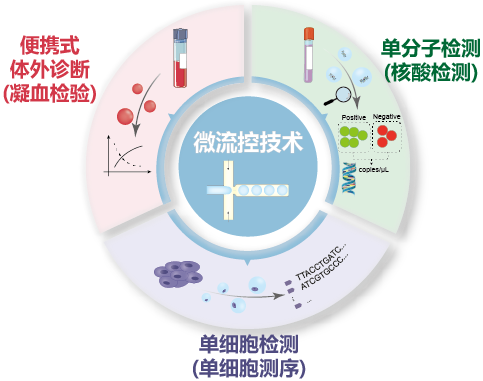
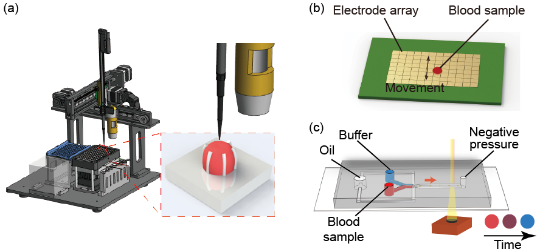
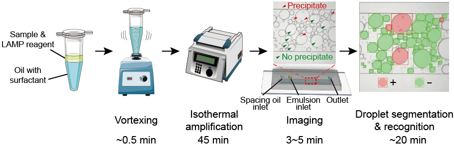
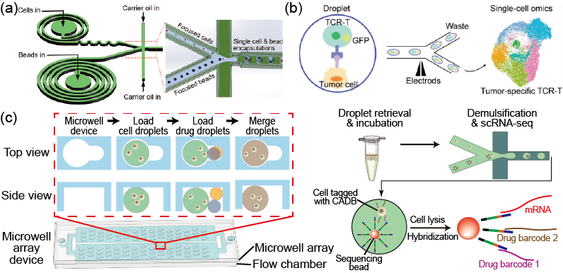

    

    我们的研究聚焦在使用微纳米技术解决生物医学工程中的前沿问题。具体包括以下如下方向： 
        <ul>
            <li><a href = "#biochip">即时凝血检验</a></li>
            <li><a href = "#ddPCR">单分子核酸检测</a></li>
            <li><a href = "#single-cell">单细胞分析</a></li>
            <li><a href = "#microfluidics">微流控新技术</a></li>
        </ul>
    

    
部分已完成或正在进行的课题如下所示。现有设备有<a href="facilities_CN.html">这些</a>。

		

	 

    

        <h2>
			即时凝血检验
        </h2>
        
        

			Monitoring of coagulation function has applications in many clinical settings, but routine coagulation assays are sample-consuming and slow in turnaround. In our lab, we leverage the advantage of microfluidics in developing miniaturized assays and develop novel coagulation assays that are applicable in point-of-care settings. Specifically, we develop microfluidic sensors that assess the mechanical properties, namely clot retraction force and viscosity, of the blood during clotting. 
        

        <h4>Relevant Publications:</h4>
        

			<ol>
				<li><b>Point-of-care blood coagulation assay based on dynamic monitoring of blood viscosity using droplet microfluidics</b>
				 <u>Linzhe Chen</u>, <u>Donghao Li</u>, Xinyu Liu, Yihan Xie, Jieying Shan, Haofan Huang, Xiaxia Yu, Yudan Chen, Weidong Zheng, and <u>Zida Li</u>*
				 <i><b>ACS Sensors</b></i>, 7(8), 2170–2177, 2022
				 <a href="https://doi.org/10.1021/acssensors.1c02360">DOI</a> | <a href="file/">PDF</a> 
				</li> 
                <li><b>Point-of-care blood coagulation assay enabled by printed circuit board-based digital microfluidics</b> 
				 <u>Donghao Li</u>#, Xinyu Liu#, Yujuan Chai#, Jieying Shan, Yihan Xie, Yong Liang, Susu Huang, Weidong Zheng, and <u>Zida Li</u>*
				 <i><b>Lab on a Chip</b></i>, 22(4), 709-716, 2022
				 <a href="https://doi.org/10.1039/D1LC00981H">DOI</a> | <a href="file/">PDF</a>
				</li> 
			    <li><b>Micro-engineered flexural post rings for effective blood sample fencing and high throughput measurement of clot retraction force</b>
				 <u>Lanzhu Huang</u>#, Xinyu Liu#, Yuanbin Ou, Haofan Huang, Xia Zhang, Yize Wang, Yong Liang, Xiaxia Yu, Weidong Zheng, Huisheng Zhang, and <u>Zida Li</u>*
				 <i><b>ACS Sensors</b></i>, 5(12), 3949-3955, 2020
				 <a href="https://doi.org/10.1021/acssensors.0c01596">DOI</a> | <a href="file/2020_ACSSensors_Huang.pdf">PDF</a>
				</li>
			</ol>
		

		

    

 	

    

        <h2>
        单分子核酸检测
        </h2>
		
        

        Nucleic acid detection plays a central role in the identification of pathogen infection, diagnosis of genetic diseases, and genetic analysis. The commonly used method of real-time PCR requires references for quantification. In contrast, the emerging technology of digital PCR offers a means for absolute quantification. However, existing digital PCR technical platforms require sophisticated instruments for compartmentalization and signal reading, limiting their widespread applications. In addition, only a handful of nucleic acid targets can be simultaneously tested. In our lab, we aim to develop low cost, portable, multiplex methods for digital nucleic acid tests using microfluidic tools and machine learning algorithms.
        

		<h4>Relevant Publications:</h4>
		

		    <ol>
				<li><b>deep-dLAMP: deep learning-enabled polydisperse emulsion-based digital loop-mediated isothermal amplification</b>
				 <u>Linzhe Chen,</u># <u>Jingyi Ding,</u># Hao Yuan, Chi Chen,* and <u>Zida Li</u>*
				 <i><b>Advanced Science</b></i>, 9(9), 2105450, 2022
				 <a href="https://doi.org/10.1002/advs.202105450">DOI</a> | <a href="docs/">PDF</a>
				</li>
				<li><b>CoID-LAMP: Color-encoded, intelligent digital LAMP for multiplexed nucleic acid quantification
				</b> <u>Kai Wu</u>,# <u>Qi Fang</u>,# <u>Zhantao Zhao</u>, and <u>Zida Li</u>*
				 <i><b>Analytical Chemistry</b>
				</i>, 95(11), 5069–5078, 2023
				 <a href="https://doi.org/10.1021/acs.analchem.2c05665">DOI</a> | <a href="docs/">PDF</a>
				</li>
			</ol>
        

        
 
    

 	
	

    

		<h2>
		单细胞分析
		</h2>
		
        

        Every cell is special. Bulk analysis takes ensemble average of the biological samples, while single cell analysis offers the opportunity to tease out cell heterogeneity. A typical pipeline of single cell analysis including cell isolation, library construction, sequencing, and stats, and droplet microfluidics offers a method to isolate and process cells with ultrahigh throughput. We are currently working on improving the performance of droplet microfluidics in single cell analysis, in terms of cell encapsulation, droplet sorting, and barcoding. We work closely with our collaborators in sequencing industry. 
		

		<h4>Relevant Publications:</h4>
		

			<ol>
                <li><b>Combinatorial perturbation sequencing on single cells using microwell-based droplet random pairing</b>
				 <u>Run Xie,</u># Yang Liu,# Shiyu Wang, Xuyang Shi, <u>Zhantao Zhao</u>, Longqi Liu, Ya Liu,* and <u>Zida Li</u>*
				 <i><b>Biosensors and Bioelectronics</b></i>, 220, 114913, 2023
				 <a href="https://doi.org/10.1016/j.bios.2022.114913">DOI</a> | <a href="docs/">PDF</a>
				</li>
				<li><b>High-throughput functional screening of antigen-specific T-cells based on droplet microfluidics on single-cell level</b>  
				 Shiyu Wang,# Yang Liu,# Yijian Li, Menghua Lv, Kai Gao, Ying He, Wenbo Wei, Yonggang Zhu, Xuan Dong, Xun Xu, <u>Zida Li</u>*, Longqi Liu*, and Ya Liu*
				 <i><b>Analytical Chemistry</b></i>, 94(2), 918–926, 2022
				 <a href="https://doi.org/10.1021/acs.analchem.1c03678">DOI</a> | <a href="docs/">PDF</a> 
				<ul>
				<li>Selected as <a href="https://pubs.acs.org/toc/ancham/94/2">Front Cover story </a> by <i>Analytical Chemistry</i>.</li>
				</ul>
				</li>
				<li><b>Dean flow assisted single cell and bead encapsulation for high performance single cell expression profiling</b>
				 Luoquan Li,# Ping Wu,# Zhaofeng Luo, Lei Wang, Weiping Ding, Tao Wu, Jinyu Chen, Jinlong He, Yi He, Heran Wang, Ying Chen, Guibo Li, <u>Zida Li</u>*, and Liqun He*
				 <i><b>ACS Sensors</b></i>, 4(5), 1299-1305, 2019 
				 <a href="https://www.ncbi.nlm.nih.gov/pubmed/31046240">PubMed</a> | <a href="docs/2019_ACSSensors_Li.pdf">PDF</a>
				</li>
			</ol>
        

		

    

 

    

        <h2>
        微流控新技术
        </h2>
			
			

				In our lab, we are also interested in developing new microfluidic tools for various biomedical applications. For example, we use real-time image analysis to identify droplets with different encapsulations and perform downstream droplet manipulations. We develop new technologies to pattern antibodies with high resolutions and multiplexity.
			

			<h4>Relevant Publications:</h4>
			

			<ol>
				<li><b>High resolution, multiplex antibody patterning using micropillar-focused droplet printing and microcontact printing</b>
				 <u>Meichi Jin</u>, <u>Kai Wu</u>, Mengzhen Wang, Yang Zhang, Chengbin Yang, and <u>Zida Li</u>*
				 <i><b>Advanced Biology</b></i>, in press
				 <a href="https://doi.org/10.1002/adbi.202300111">DOI</a> | <a href="docs/">PDF</a>
				</li>
				<li><b>Image-activated pico-injection for single cell analysis</b>
				 <u>Zhantao Zhao</u>, <u>Heng Zhai</u>, Peng Zuo, <u>Tao Wang</u>, <u>Run Xie</u>, Mu Tian, Ruyuan Song, Xiaonan Xu, and <u>Zida Li</u>*
				 <i><b>###</b>
				</i>, under review
				 <a href="">DOI</a> | <a href="docs/">PDF</a>
				</li>
			</ol>
			

		<!-- 
 -->
    

